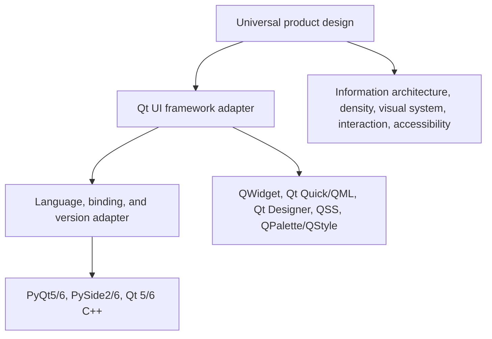

[简体中文](README.md) | **English**

# Qt UI Engineering

`qt-ui-engineering` is an Agent Skill for designing, implementing, and reviewing professional interfaces across the Qt ecosystem. It combines product-specific visual direction with Qt-native implementation discipline and an Information-Density First preference for efficient desktop workflows.

The Skill preserves the current project's stack. It does not silently migrate PyQt5 to PyQt6, PySide to PyQt, QWidget to QML, Qt 5 to Qt 6, or C++ to Python.

## Core model



- **Universal design** defines product intent, information hierarchy, semantic tokens, density, interaction, desktop UX, and accessibility.
- **Framework adapters** translate that intent into QWidget, QML, Designer, or styling mechanisms.
- **Binding/version adapters** keep imports, enums, signals, execution methods, module locations, and build targets correct for the detected stack.

Read [SKILL.md](SKILL.md) for the complete routing workflow.

## Supported matrix

| Dimension | Supported targets |
|---|---|
| Python binding | PyQt5, PyQt6, PySide2, PySide6 |
| C++ | Qt 5, Qt 6 |
| UI framework | QWidget, Qt Quick/QML, Qt Quick Controls, Qt Designer `.ui` |
| Styling | QSS, QPalette, QStyle, QProxyStyle, Qt Quick Controls styles |
| Product concerns | design systems, theming, high information density, interaction states, desktop UX, accessibility, UI review |

Support means the Skill selects stack-specific guidance. It does not claim that one implementation works unchanged across every target.

## Install

The repository root is the Skill directory. Clone or copy it into the Skill location used by your Agent runtime.

Project-scoped Cursor/Codex layout:

```text
your-project/
└── .cursor/
    └── skills/
        └── qt-ui-engineering/
            ├── SKILL.md
            ├── references/
            ├── templates/
            ├── examples/
            ├── evals/
            └── scripts/
```

Clone the public GitHub repository directly into that directory:

```text
git clone https://github.com/zxzvsdcj/qt-ui-engineering.git .cursor/skills/qt-ui-engineering
```

Do not place it in a runtime-managed internal skills directory. If your runtime uses a different personal/project Skill path, use that runtime's documented location while keeping this directory structure intact.

## Use

The description automatically targets Qt UI design, implementation, theming, redesign, and review work. It can also be named explicitly:

```text
Use qt-ui-engineering to redesign this PySide6 QWidget analysis workspace.
Preserve the current binding and QSS architecture. Prioritize high information
density, keyboard efficiency, complete interaction states, and a formal UI review.
```

For an audit:

```text
Use qt-ui-engineering to review this Qt 6 QML control panel. Report the detected
stack first, then prioritize findings by severity with evidence and remediation.
```

The response contract is:

1. Detected stack
2. Design intent
3. Implementation
4. Review
5. Risks

## Static stack detection

Run the read-only detector from the Skill root:

```text
python scripts/detect_qt_stack.py <target-project> --pretty
```

It reports language, Qt major version, Python binding, UI frameworks, styling, architecture hints, platform hints, source evidence, warnings, and `ok`/`unknown`/`conflict` status.

The detector never imports the target's Qt packages or executes target code. It is deliberately conservative: read its evidence in the files you will modify before choosing adapters. See [stack detection](references/stack-detection.md).

## Design artifacts

- [Design brief](templates/ui-design-brief.md): product, users, context, information architecture, density, visual direction, and success criteria.
- [Design tokens](templates/design-tokens.md): primitive, semantic, component, typography, spacing, density, state, and adapter mappings.
- [UI review](templates/ui-review.md): severity, evidence, consequence, remediation, gates, and residual risks.

## Validate

The project uses only the Python standard library for automated checks:

```text
python -m unittest discover -s tests -v
python scripts/validate_skill.py .
```

The validator checks required files, Skill frontmatter, the 500-line limit, relative Markdown links, incomplete instruction markers, and the six-case evaluation matrix. Historical conversation and planning documents are excluded from instruction-surface scans.

Six evaluation fixtures cover:

- PyQt5 + QWidget + QSS
- PyQt6 + QWidget + QSS
- PySide2 + QWidget
- PySide6 + QWidget + QSS
- Qt 6 + QML
- Qt 5 + C++ + QWidget

Use [the evaluation rubric](evals/rubric.md) for qualitative trials. It separates measurable Qt/structure checks from visual judgment.

## Project structure

```text
SKILL.md                   main trigger, workflow, routing, and quality gates
references/                universal design guidance
references/adapters/       framework, styling, binding, and version adapters
templates/                 reusable design and review artifacts
examples/                  concise adapter-boundary examples
evals/                     six fixtures, pressure cases, expected profiles, rubric
scripts/                   static detector and structural validator
tests/                     standard-library automated tests
docs/                      approved design and implementation plan
```

The original requirements record is intentionally retained only in the local workspace and excluded from version control.

## Sources and synthesis

The Skill is an independent synthesis. It paraphrases concepts and does not copy the source Skills wholesale.

- [Qt official `qt-ui-design`](https://github.com/TheQtCompanyRnD/agent-skills/blob/main/skills/qt-ui-design/SKILL.md): Qt-aware context, platform/input constraints, accessibility, and audit discipline.
- [Anthropic `frontend-design`](https://github.com/anthropics/skills/blob/main/skills/frontend-design/SKILL.md): product-specific visual direction, restraint, and critique.
- [Microsoft `frontend-design-review`](https://github.com/microsoft/skills/blob/main/.github/skills/frontend-design-review/SKILL.md): review modes, task efficiency, trust, and severity.
- [Qt Style Sheet syntax](https://doc.qt.io/qt-6/stylesheet-syntax.html), [QPalette](https://doc.qt.io/qt-6/qpalette.html), and [Qt Quick Controls styles](https://doc.qt.io/qt-6/qtquickcontrols-styles.html): implementation constraints.
- [PyQt6/PyQt5 differences](https://www.riverbankcomputing.com/static/Docs/PyQt6/pyqt5_differences.html): binding-version distinctions.

## Limitations

- Static detection cannot prove installed runtime versions, generated sources, or deployment platform.
- Adapters summarize meaningful boundaries; they do not replace the official documentation for an exact Qt minor version.
- No Qt SDK or Python binding is installed by this repository, so fixtures validate detection rather than compiling six GUI applications.
- Visual taste and workflow quality require rendered, interactive review; deterministic tests do not claim to measure them.
- Fresh-agent behavioral repetitions were not run in the creation session because subagent dispatch was not authorized. Six reusable pressure cases and a weighted rubric are included for later trials.
