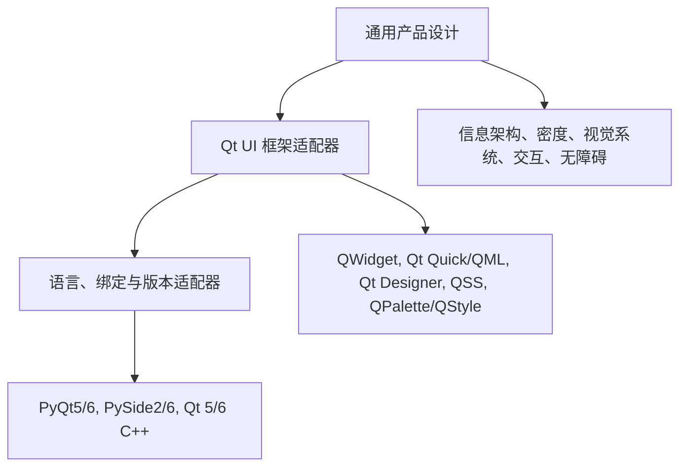

**简体中文** | [English](README.en.md)

# Qt UI 工程

`qt-ui-engineering` 是一个面向 Qt 生态的 Agent Skill，用于设计、实现和审查专业用户界面。它将契合具体产品的视觉方向、Qt 原生实现纪律，以及优先服务高效桌面工作流的“信息密度优先”原则结合起来。

该 Skill 会保留当前项目采用的技术栈，不会擅自将 PyQt5 迁移到 PyQt6、将 PySide 换成 PyQt、将 QWidget 改为 QML、将 Qt 5 升级到 Qt 6，或将 C++ 改写为 Python。

## 核心模型



- **通用设计**定义产品意图、信息层级、语义化设计令牌、信息密度、交互方式、桌面端 UX 和无障碍要求。
- **框架适配器**将设计意图转换为 QWidget、QML、Designer 或相应样式机制中的实现方式。
- **绑定/版本适配器**确保导入、枚举、信号、执行方法、模块位置和构建目标与检测到的技术栈保持一致。

完整的路由工作流请阅读 [SKILL.md](SKILL.md)。

## 支持矩阵

| 维度 | 支持目标 |
|---|---|
| Python 绑定 | PyQt5, PyQt6, PySide2, PySide6 |
| C++ | Qt 5, Qt 6 |
| UI 框架 | QWidget, Qt Quick/QML, Qt Quick Controls, Qt Designer `.ui` |
| 样式系统 | QSS, QPalette, QStyle, QProxyStyle, Qt Quick Controls styles |
| 产品关注点 | 设计系统、主题、高信息密度、交互状态、桌面端 UX、无障碍、UI 审查 |

这里的“支持”表示 Skill 能够选择与技术栈对应的指导内容，并不表示同一份实现可以不经修改地适用于所有目标。

## 安装

仓库根目录就是 Skill 目录。请将它克隆或复制到 Agent 运行时使用的 Skill 位置。

项目级 Cursor/Codex 目录结构：

```text
your-project/
└── .cursor/
    └── skills/
        └── qt-ui-engineering/
            ├── SKILL.md
            ├── references/
            ├── templates/
            ├── examples/
            ├── evals/
            └── scripts/
```

可以直接把公开 GitHub 仓库克隆到该目录：

```text
git clone https://github.com/zxzvsdcj/qt-ui-engineering.git .cursor/skills/qt-ui-engineering
```

不要将它放入由运行时内部管理的 Skill 目录。如果你的运行时使用其他个人或项目级 Skill 路径，请遵循该运行时的文档，同时保持本项目的目录结构不变。

## 使用

Skill 描述会自动匹配 Qt UI 设计、实现、主题、重设计和审查任务，也可以在提示词中明确指定：

```text
Use qt-ui-engineering to redesign this PySide6 QWidget analysis workspace.
Preserve the current binding and QSS architecture. Prioritize high information
density, keyboard efficiency, complete interaction states, and a formal UI review.
```

用于审查时：

```text
Use qt-ui-engineering to review this Qt 6 QML control panel. Report the detected
stack first, then prioritize findings by severity with evidence and remediation.
```

输出契约为：

1. 检测到的技术栈
2. 设计意图
3. 实现
4. 审查
5. 风险

## 静态技术栈检测

在 Skill 根目录运行只读检测器：

```text
python scripts/detect_qt_stack.py <target-project> --pretty
```

检测结果包括语言、Qt 主版本、Python 绑定、UI 框架、样式系统、架构线索、目标平台线索、来源证据、警告，以及 `ok`/`unknown`/`conflict` 状态。

检测器不会导入目标项目的 Qt 包，也不会执行目标代码。它有意采用保守策略：选择适配器之前，仍需阅读即将修改的文件并核对检测证据。详见[技术栈检测](references/stack-detection.md)。

## 设计产物

- [设计简报](templates/ui-design-brief.md)：产品、用户、使用情境、信息架构、密度、视觉方向和成功标准。
- [设计令牌](templates/design-tokens.md)：基础、语义、组件、排版、间距、密度、状态和适配器映射。
- [UI 审查](templates/ui-review.md)：严重程度、证据、后果、修复方案、质量门禁和残余风险。

## 验证

项目的自动化检查只使用 Python 标准库：

```text
python -m unittest discover -s tests -v
python scripts/validate_skill.py .
```

验证器会检查必需文件、Skill frontmatter、500 行限制、相对 Markdown 链接、未完成的指令标记以及六类评测矩阵。历史会话和规划文档不会参与指令表面扫描。

六个评测夹具覆盖：

- PyQt5 + QWidget + QSS
- PyQt6 + QWidget + QSS
- PySide2 + QWidget
- PySide6 + QWidget + QSS
- Qt 6 + QML
- Qt 5 + C++ + QWidget

定性试验请使用[评测量表](evals/rubric.md)。量表将可测量的 Qt/结构检查与视觉判断分开。

## 项目结构

```text
SKILL.md                   主触发器、工作流、路由和质量门禁
references/                通用设计指导
references/adapters/       框架、样式、绑定和版本适配器
templates/                 可复用的设计与审查产物
examples/                  简明的适配器边界示例
evals/                     六类夹具、压力场景、预期配置和量表
scripts/                   静态检测器和结构验证器
tests/                     基于标准库的自动化测试
docs/                      已批准的设计与实施计划
```

原始需求记录有意仅保留在本地工作区，并排除在版本控制之外。

## 来源与综合方式

本 Skill 是独立综合成果。它对相关概念进行了转述，没有整段复制来源 Skill 的内容。

- [Qt 官方 `qt-ui-design`](https://github.com/TheQtCompanyRnD/agent-skills/blob/main/skills/qt-ui-design/SKILL.md)：提供 Qt 场景感知、平台与输入约束、无障碍及审查纪律。
- [Anthropic `frontend-design`](https://github.com/anthropics/skills/blob/main/skills/frontend-design/SKILL.md)：提供契合具体产品的视觉方向、克制原则和批判性审视方法。
- [Microsoft `frontend-design-review`](https://github.com/microsoft/skills/blob/main/.github/skills/frontend-design-review/SKILL.md)：提供审查模式、任务效率、信任和严重程度划分方法。
- [Qt Style Sheet syntax](https://doc.qt.io/qt-6/stylesheet-syntax.html)、[QPalette](https://doc.qt.io/qt-6/qpalette.html) 和 [Qt Quick Controls styles](https://doc.qt.io/qt-6/qtquickcontrols-styles.html)：提供实现约束。
- [PyQt6/PyQt5 differences](https://www.riverbankcomputing.com/static/Docs/PyQt6/pyqt5_differences.html)：提供绑定版本差异。

## 已知限制

- 静态检测无法证明已安装的运行时版本、生成源码或部署平台。
- 适配器总结关键边界，但不能替代针对具体 Qt 次版本的官方文档。
- 本仓库不会安装 Qt SDK 或 Python 绑定，因此夹具验证的是技术栈检测，而不是编译六个 GUI 应用程序。
- 视觉品味和工作流质量需要通过渲染后的交互审查来判断；确定性测试不会宣称能够衡量这些内容。
- 创建期间未运行由全新 Agent 重复执行的行为试验，因为当时未获得子代理调度授权。仓库已包含六个可复用的压力场景和一份加权量表，供后续试验使用。
